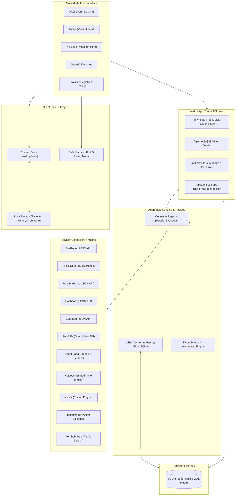

# Nexus18 / All18 (y.all18)

[](https://github.com/anhot11/ALL18/releases/download/v1.0.0/all18n.apk)
[](.github/workflows/ci.yml)
[](https://nextjs.org/)
[](https://www.typescriptlang.org/)
[](https://tailwindcss.com/)
[](https://www.sqlite.org/)

**Nexus18** (package `y.all18`) is a high-performance, scraping-resistant media aggregation platform that unifies content from dozens of verified free tube sites, animated GIF platforms, anime/hentai repositories, and image boards listed on [theporndude.com](https://theporndude.com).

The app runs natively on **Web**, **Mobile Web (PWA/touch-optimized)**, **Electron Desktop (Windows/macOS/Linux)**, and complements the native **Android APK** release.

---

## 🌟 Core Features & Viewing Modes

| Mode | Visual Paradigm | Key Capabilities |
| :--- | :--- | :--- |
| **All18** | **Pornhub-Style Grid** | Responsive masonry grid, category chips, duration filters (`<5m`, `5-20m`, `20m+`), format filters (videos, GIFs, anime, images), search, hover previews, and modal player. |
| **TikTok** | **Vertical Reels Feed** | 100vh full-screen vertical swipe with gesture detection, auto-play with instant unmute, animated double-tap heart burst, audio disc rotation, and prioritized short clips under 90s. |
| **𝕏 Feed** | **Twitter / 𝕏 Timeline** | Real-time social cards, verified provider badges, formatted hashtags, "For You" & "Following" tabs, local retweets, bookmarks, and inline expandable players. |
| **0 dB Safe Mode** | **Total Audio Silence** | 1-click global mute guarantee to ensure safe browsing without accidental sound emissions. |
| **Saved Library** | **Favorites & Watch Later** | Client-side persistence for bookmarked media and playback history. |
| **Provider Registry** | **Curation & Scraper** | Manage providers, toggle individual connectors, update feed priority, and execute scheduled automated scrapers for ThePornDude free sections. |

---

## 🏛️ System Architecture



---

## 🔌 Included Out-of-the-Box Connectors

1. **RedTube**: Official REST API (`api.redtube.com`) with HD thumbnails, duration, tags, and verified status.
2. **EPORNER**: Ultra HD 1080p and 4K video feeds with official JSON API and embed player.
3. **Rule34**: Animated anime clips, 3D blender loops, and artwork booru JSON API.
4. **Danbooru**: Tagged high-resolution anime illustration repository with character search.
5. **Gelbooru**: Anime/manga video and artwork boards with JSON feeds.
6. **RedGIFs**: High-definition looping video clips with sound, tailored for the TikTok and 𝕏 modes.
7. **SpankBang**: Modern free tube scraper with responsive embeds and 4K indicators.
8. **XVideos**: High-volume free tube indexer with responsive embed frames.
9. **XNXX**: Classic high-volume tube indexer with fast loading thumbnails.
10. **HentaiMama**: Animated hentai series, uncensored episodes, and animation streams.
11. **Pornhub (Public)**: Public search parser with embed video players.

---

## 🛠️ How to Add a New Connector

All connectors extend `BaseConnector` located in `src/lib/connectors/base.ts`. To add a new provider:

1. Create `src/lib/connectors/mysite.ts`:

```ts
import { BaseConnector } from './base';
import { FilterOptions, MediaItem } from '../../types/media';

export class MySiteConnector extends BaseConnector {
  id = 'mysite';
  name = 'MySite';
  category = 'tube' as const; // 'tube' | 'gif' | 'image' | 'anime'
  baseUrl = 'https://mysite.com';
  icon = '🎬';

  async search(query: string, page = 1, filters?: FilterOptions): Promise<MediaItem[]> {
    // Fetch and return MediaItem[]
    return [];
  }

  async getTrending(page = 1, category?: string): Promise<MediaItem[]> {
    // Fetch trending videos
    return [];
  }

  async getLatest(page = 1): Promise<MediaItem[]> {
    // Fetch latest videos
    return [];
  }

  async getCategories(): Promise<string[]> {
    return ['Amateur', 'HD', 'POV'];
  }

  async getVideoDetails(id: string): Promise<MediaItem | null> {
    // Return detailed metadata and embedUrl
    return null;
  }
}
```

2. Register the connector in `src/lib/connectors/registry.ts`:

```ts
import { MySiteConnector } from './mysite';

// Inside constructor:
this.register(new MySiteConnector());
```

---

## 🚀 Getting Started

### Prerequisites
- Node.js 18.x, 20.x, or 22.x
- npm, yarn, or pnpm

### 1. Installation
```bash
git clone https://github.com/anhot11/ALL18.git
cd ALL18
npm install
```

### 2. Run in Development Mode
```bash
npm run dev
```
Open [http://localhost:3000](http://localhost:3000) in your browser.

### 3. Verify Connectors & DB
```bash
npm run test:connectors
```

### 4. Run Automated ThePornDude Scraper
```bash
npm run scrape:providers
```

### 5. Production Build
```bash
npm run type-check
npm run build
npm start
```

---

## 💻 Electron Desktop Application

Nexus18 includes an Electron wrapper for desktop deployment:

```bash
# In terminal 1: Start Next.js
npm run dev

# In terminal 2: Launch Electron
npx electron .
```

---

## 🔄 GitHub Actions & CI/CD

- **`ci.yml`**: Automatically runs linting, TypeScript type-checking (`tsc --noEmit`), and production build on every push and PR.
- **`weekly-provider-refresh.yml`**: Scheduled weekly cron (every Sunday at midnight UTC) that executes `scripts/scrape-theporndude.mjs` and commits updated provider records to the repo.
- **`deploy.yml`**: Automated Vercel production deployment triggered on pushes to `main`.

---

## ⚖️ Legal & Ethical Constraints

- **Aggregation-Only Architecture**: Nexus18 does not host, mirror, or store video files. All playback occurs via official public embeds or direct CDN streams from the original providers.
- **Age Restriction**: Access is strictly limited to individuals 18 years of age or older (enforced via the interactive Age Gate).
- **Free Content Only**: Only 100% free public sites listed on ThePornDude are indexed. Paid content, cam sites, and subscription services are strictly prohibited.
- **Takedowns & DMCA**: All content belongs to its respective owners. Removing media from origin providers automatically removes it from Nexus18.

---

## 📄 License
This project is open-source under the [MIT License](LICENSE).
